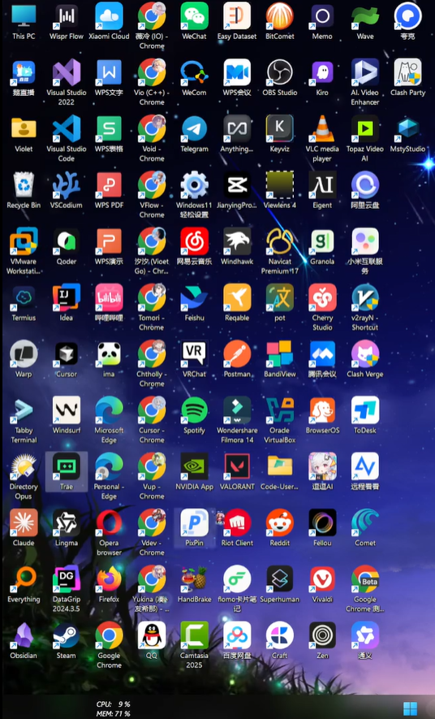

> 提取时间：2025/10/18 14:29:06

防御百分之，有评论区域吗，嗯那还没共享屏幕，呃很抱歉，那个买来了一些之前遇到的一些网购问题，大家能听到吗，能听到，要不评论区扣个一，OK 哦 OKOK，嗯声音有点小，这个小号在拼音室，哦现在声音还小吗，应该正常了吧，张口不开，你看我们先从个打开备存文档，如果声音比较小的话，大家等下可以在评论区里面直接 call 我，然后我能看看得到，很大的噪音吗，新瑞风扇看一下，别怪了，真，现在应该比较好，今晚主要就是跟大家讲讲，我们按计划的那一个 web，就是一个完整的 web 前后端系统，给一个开发全流程，然后其实主要还是回答一下大家的一，些关键问题吧，就因为我之前看我们那个群里面有不少同学，在前期的那个配环境，还有那个前期那些小项目都是遇到的不少问题，所以这一次直播，我觉得也可以趁这个机会专门解答一下，等一下我要先调一下那个东西下，是不是，现在好像就正常，刚才提示我有点断了，我不管了，先开始吧，因为实在有问题，下次再说吧，Ok，现在好了吗，嘶嗯看有没有出消息啊，没有没有取消息，我们先打开一个，从破局行动讲起吧，嗯大家前期应该都已经把前面的环境配置，安装好了以后，然后还有之前晚安老师直播的时候，一应该是把我们第一个案例一嗯，可能很多同学都都已经做完了，所以今天我主要想给大家讲一下，就是一个完整的前后端和系统，到底应该怎么做的嘛，哎，OK 好我就就行了，就是在我们日常生活中，就我们生活方方面面，就我们给同事朋友发文件，我们去淘宝京东上面买东西，去美团点外卖，还是说去 1136 买车票，那其实他们本质上都是一个嗯，包括增删改查的管理系统嘛，所以在本期行动营中，我就选择了这一个管理系统，作为我们完整前后端 web 开发实战全流程，给一个比较经典的案例，所以也也也也希望大家通过嗯，做一个从你从这基本管理系统做起，然后就能够，更加在熟练掌握 AI 编程的一些技巧和方和方法，因为在这个文文档的话考，由于文港的一个局限性，我当时是把一些流程给列出来了，今天主要是先嗯先演示一下吧，然后等下后面后半段大家有具体一个问题，可不可以直接发在评评论区，我再统一回回改一下嗯，这个先不管，嗯是嗯，我先猜，从第一步开始，第一步我发现就是很多朋友不知道怎么开启，call 个扣格，这个其实我觉得是比较震惊的，就大家可以在桌面就是最好你用 vscode 也好，你用你用 COSER 也好，你用 COA 也好，你用去也好，反正你打开任意一个软软件，然后呢进到旁边这一个终端，然后新建一个中终端，然后呢它它就出来了，然后你在这里面去输入我们的可可 OUD，以后他就会给我们启动一个靠个实例了，所以之前大家可能很多时候会哎操哎，之前大家可能很很多时候会选择，就是从这里去搞开，那这里他其实是比较麻烦的，我不推荐这么做，所以建议大家还是在 V 在 vscode 或者 cursor，或者任意一个这种集成终端里面去用，我觉得这样子大家会会用的比较方便，然后第二步的话就是我们得先想一个需求是吧，就是像我在文档里面写的，我们需求其实主要有两种，就第一种是我们自己呃想 webcoin，一个恭喜我们自己有一个小创意，我们有一个突发奇奇想，有一个奇思妙想，就比就这嗯就比如说嗯我们想去搞一个酒酒店，然后呢就自然需要有有一个酒店的房间，房客的一个管理系统，我们自己去开一个店电商，那那自然也要有一个电商的商城系统，反正不管怎么说，我们首先要整理一下，所以我我我觉得第一步的关键是，我我我们要先写下，写下一句话，然后去表达我们自己想做什么对吧，然后就你可以去用任意一个 AI 用豆包也好，用 GIPSK 也好，用这个通义千问也好，然后就直接去问他对，就这么非常简单的一个过程，就我们从一个你从一句话最简单的需求，然后呢，让 AI 帮我们先拓展成一个就是以及功能规划嗯，在在现在这个 AI 编程的这样一个阶段，我们先做计划再去编码，卡是很重要的，它他计划和编码的一个实际比例，甚至可以占到 80%，和 20%的这样一个比例，你可以看到像我这样子随口问一句，那基本上 AI 就已经能够帮我们，把很多细节全部写好了对吧，然后我之我记得之前群里面有同学，他问过洗号的怎么办，嗯就是生成这一份文档怎么办，就是其实我当时是写了一句话的，但感觉有有些同学可能还有点疑惑，那我直接现场演示一下，就是说哼你就直接新建一个文件对吧，就比如叫这个，需求拷问的一个 markdown 文档，就直接点击这个新建文件，然后呢复制就然后进来，那这样子他就有一个文档了，嘶哎呀，给我们有很多问题啊，我开了一个新新包，这里的话就我们一般是要先新建一个目录，来来方便你自己的开发，嗯我可以再讲细一点，就是打开你的 vscode，然后点击文件，然后点击这一个打开文件夹，然后选择你你要你要的文文，你选择你想要的那一个文件夹，然后放进去，这样子才叫这，就这样子才算一个基本的开发流程，然后同样的就是新新建一个文本，好就就就这样，然后我们就可以让 AI 基于这，我们上面做好的这一个文档，去做一个具体的一个项目，射击嘛，你可以选择用 at，然后去选中我们刚才所说的这一个讨论文档，真棒吧，啧啧，这一个号是，现在 AI 开发过程它其实就是一个嗯，我就是现在 AI 开已经很聪明了，我们直接用自然语言清晰具体表达，我们要做一个什么，在这个学习中，我们要做一个 web 后端服务，然后呢我们需要先想想，让他先给出一个文档，那这个我们就用自然语言去向他嗯，很自然的去表达出来就可以了，嘶，有个评论，额这个克劳格官方他是需要魔法的，但是我们推荐大家直接使用国产的一个平替，就是质朴，他新推出了那这一个 GRAM4.6 模型，给我们写文档，就是我们 9 月初写的文稿，4.5 还是最新的模型，然后他月底马上推出了这个 4.6 的模型，你你直接在在它官网就能够订阅了，就是他最低只需要 20 元就可以有有包月卡，20 元额度，基本也能够满足大家的一个基础需求，可以先用起来，那看具体怎么配，这里我们也帮大家写好，就就是你进去之后，他甚至直接已经都帮你写好了，很多的那一个步骤，现在还有就是就是配这个 cc 加国产模型，诶个 key 还有困难的同学吗，应该有问题的话，可以在在群里面就让我们再去解答一下，我我们继续回到这一个项目呀，就比如说我们有了一句话需求，然后呢又用 AI 帮我们，就是在这种缺个 boss 聊天机器人里面，让他帮我们从一句话扩写成一个产品设计文稿，然后再把产品设计文，文文文档告诉 cc 和古彩模模型，然后让他们去帮我们，在输出为一个系统设计的文档，就是你可以看到他整个流程下来，他都是文岗接文档的，就现在 AI 编程它已经进入到了一种文档驱动，或者或者叫做规范驱动开发的一个新范式，就你就我们需需要先将大量的一个思考和讨，论的工作变成文稿落，就是先先落地成成文稿，先写好我我们到底想要什么，那他里面给我有哪一些原则，然后我们要做哪些对象，就还有有哪些对象，其实不用你自己去想，你可以告诉 AI 去写，对于我们这样一个，所以你可以发现，其实很多就是 80%，甚至 90%的工作，目前是可以用 AI 去替代完成的，那我们人目前做的一个工作，更多的是一个嗯宏观规划，和事后审核的一个工作，所以那那有些人想，就是就如果你是要做一个企业级，做一个给公司做一个大几 10 万个系统，那肯定要比较严肃严格是吧，就是你自己肯定得要有专业的知识技能，但是对于我们这样一个呃很比较基础，比较简单，但是完整前后端给一个东西来说，它其实是很简单的，你全部让 AI 去帮你去想去写就行了，就不用去纠结太他到底写歌更不更，就是，我们第一步要先定位杨哥，他也总喜欢说定位并江山对吧，那我们，作为编编程第一步，其实首先就是要定位，就我们首先要定位出我们今天要做一个东西，大概是属于 demo 级别的，还是属于一个就是那种小而美的产品，能够最快帮你赚到第一桶金的东西，还是说你自己能力比较强，你有能力有渠道，有客户，有以后能接到企业服务的订单，那他们这就是三种需求，三角学他他跟英格是完全不同的，就是三种三种不同复杂度的需求，它对应的是完全不同的编程方法论，嗯然后我相信有很多同学他也会想问，就是我们嘶就我自己什么都不懂啊，我我自己比较小白，我自己不是编程技术背景，那能不能做 AI 编程，那我现在就就是我现在可以直接跟大家讲，就是我们做前两种，就我们自己做一个 demo，小小玩具，或者说做一个小产品，他其实是，现在已经完全不需要编程和技术背景了，因为，就是小产品的关键是垂直领域的长尾需求，就比如说额客户想要拿个 PDF 图片，这种裁剪修改，二次编辑开发等等等等等等，还是说客户想要去爬一下 S 啊，还有小红书啊，还有那个抖音，就这一类这种客户垂直领域的需求，那我们现在拿 AI 开发，是开发几个小产品，然后呢你又能接接高这种关键领域的长尾需求，它是不需要编程技术背景的，就除非你要做一个呃非常复杂的系统，你要能够应付几万人，几 10 万人来一起用，那种情况下才去考虑所谓的编程的，一些专业知识的要求，没问题，嗯我看事不宜迟，先往下讲没有，你看就是嗯，然后我们用 AI 帮我们写完这些文档之后，就可以让他基于我们上述的考的讨论，直接去完成一个完整的前后跟干吸口，也是自然语言，就跟他说就可以了，那我们先让他把这个沉淀尾文稿好吧，这有什么好，让他先在这里写一下，我们可以先先继续讲，哼你要形容比较比较就是嘶，就我们无论是去接一些大学生特色和订单，还是说一些嗯小企业，外包订单，还是说一些就是真正一些小企业能实用的，一些学习系统，他们目前都可以叫做管理系统，就是目前这一块的一些需求，我们用 AI 写，他其实是已经写格很完善，就我们现在只要把文档写好了，只要把把文档给先写好，然后呢再让 AI 去根据文档去去编码，那这个过程之后，就就基本上不太需要人去参与了，然后让他写个，然后我们就可以跟他说，基于我们的设计文稿，嘶我这里我我感觉我应该还没有装那个东西，现场装一个吧，嗯加，嘶嗯就我一切目就是小需求，完全从头到尾都用自然语言去驱动开发，我们可以不用看一行代码，但大家还是最好要注意一下，叫做姿势，是小需求啊，就是要明要明确就是自己到底要做什么，这这就是所谓的定位定江山，就是我们一定要知道自己做的业务，需求到底有多复杂，以前有个笑话，就是叫做有老板要你 5 万做一个淘宝，有这种就是非常令人啼笑皆非的，然后这里你可以看看到，就是像这个 PMPM 它是一个包管理器，然后呢我们是没安装的，那这里你可以直接让让 AI 帮你去安装，就，就你直接让 AI 帮你去安装所有的一切，就你只要装好 nodejs 之后，那一切都可以让 AI 帮你去安装嘛，反正他就他就能自己往里跑啊跑啊跑啊跑，你的时间就过得很快，能乱讲个玩，对，就就就如果说 AI 它第一次生成的是设计文档嗯，你自己不满意，你你自己有很多二次开发，就是你自己有有很多自己的想法，你就觉得跟他讨论，让他改，或者你如果是其中某个字嗯，你想改改一下，那你就就就直接改原始，这个这个原始内容就可以了，你如果说是比如说这一块你不满意，你就将就让他帮你直接重写，反正就是全部让 AI 全部以，这样就是同一个文档为一为唯一事实依据嘛，用什么技术在嗯对，这也是一个挺好的问题，就是输一下吧，就你自己，我们自己也可以反复跟 AI 强调这一句话，叫他去参考这里面的定义，来帮你去写，技术站的话目其实主要就是分为一个前端，后端和数据库，前端现在基本就是 react 了，就因为他 react 特和训练语料是最多的，这个就基本上无庸置疑，一个后端其实主要有两种，第一种就是 nestjs，它是一个全站的一个过程，要不就是如果小白更加友好的话，就是 Python 个 flask 这样一个框架，就是嗯我想跟大家讲一下，啊这个不需要这电脑配置的话，就是你他跟电脑配置等于没有要求，因为除非你是说 10 年前真的那种老电脑啊，就是非常非常老的电脑，那可能有时候会有点卡顿，那正常一般你现在四五千买到的笔记本也好，台式机也好，只要是你正常 56 年内买个电脑，都不会有什么太大的问题，spring 的话它是 java 这样的一个呃，偏向企业级的技术站的呃，我个人是不推荐 java 的，包括像 c#，就是这种，因为他太尬了，然后他太重，然后呢就是我自己是不太喜欢这些东西，就除非，对就是除非是甲方要求你用 java，那你不得不用 java，不然你自己个人的话基本上用，就是你我们个人开发自己一个项目，或就是个人项目呃，就是呃我们自己做一个出海战，自己做一个工具站，那这种需求看我，我们要的是快速上线，然后呢要的是效率对吧，就是有嗯，所以不可以建企业级的框架，你要看门对于 AI 的友好，看就是 AI 也不友好，嘶嘶，如果你你是有一个模板，然后想让他改写的话，AI 肯定是能做对吧，就是 AI 他先能力已经比较强，你直接基于已有的 spring 模模板去改，那他也能做得很好，嗯这个同学，这一个就很明显是属于甲方要求你用 java，那你就不得不用嘛，然后呢，java 的话，因为他但是他转瓦他确实是 AI 不友好，就是他很多他没有训练语料对吧，所以还是那句话，就是甲方要求你用，你就不得不用，那就是你自己去用 AI 去尝试呗，然后我们一般自己做一个偏个人，跟一些快速搞副业，出海工具占格项目，一般是完全不可以建这东西的，就是不推荐用 java，还是更推荐用 NOG 和 Python 的一个生态看门，总而言之还是 AI 友好呢，就这不是我们说了，算是 AI 他自己的一个接受度的问题，反正以后你可以看到他一下子给五，我们生成了一个比较完整的个代码，就是通过这样，一句话就是通过我们在 cover 点 MD 这一个设计文档，里面所约定好的这这么多信息，然后来来来帮我们去生成了这一堆代码，看看能能不能用一下，哦对还还还还没讲完呢，前端就是 Rest，然后呢前然后还还有 VOE，但是 VUE 它也是一个是我们国产的一个，前端的框架，那这里面的问问题是呃，除非做，就是你做这样的一些订单，他们可能会要求你用 VUE，那不然还是那句话，个人个人出海工具站这一类项目，还是推推荐 AI 友好的这样一个技术站，那核心逻辑就是 AI 友友好，快洗完了，嗯然后数据库的话，咳咳就数据库，这里跟大家科普一下，主要有两种，第一种就是说我们直接用云，用云用 super 贝贝斯这种云服务，就是他帮我们就你我们直接去搜这东西，就能发现他帮我们打包好了，非常非常多的的东西，但是他免费额度肯定是有限的，就是大家自己前期做一两个项目，可以先用它，后期可能还需要考虑一个迁移的问题，那第二个就是自己，第二种方案就是自己去买一个云服务器，就是像阿里云，腾讯云，各种云，他们现在服务器的新手优惠其实都非常低，其实你可以很容易看到，当然这里不是阿里云的广告啊，就是哪个云都可以跟没有什么区别，就是你你可以看到，就你新用户做一个个人网站，个人 web 应用去买一个服务器的话，它其实你能抢到这，你你能抢到优惠就是 33481 年，你你正常你没优惠开，也只需要 60881 年，就买一个这种最低配的轻量服务器够，就已经能够供你搭建一个个人网站了，就是完全足够的，有问题吗，没问题啊，没有看过西嘶，这里面其实嗯还有两种情况吧，就第一种就是你如果是只做存钱跟，你也就是案例一里面，就是做案例一这样的一个存钱端应用的话，那我们就是不需要后干的，就我们可以直接用 UV 这种托管的服务，哎爆了不小规模直播不要紧，像 UUV 尔这种的话，他就是直接帮你们搭建了一个平台，然后提供了一些适量的个人免费额度，你可以直接就点击做一个同款，然后呢你再卡个在哪里，是哦这里啊，pro 就是你直接上上传那一个存钱干个 HTML 文件，那它就能帮你做部署，然后前上次 YY 老师应该好像也分享过，用 GITHUB 做一个部署的，就是我们把项目上传到 GITHUB 上，还算了，现在你们弄这几个仓库就行，那我这里就先不展示了，因为有一些个人的信息，就就这些事情的底层逻辑是什么呢，就是有很多的产品，这我们相信总结是这样这样一句话，就是叫做世界上所有呃你需你的痛点，你的需求都有公司在解决，刚才那他们的区别就是说有些是要直接付费的，但是大部分的产品，他都会对新用户提供一些免费额度，大家前期自己做一个个人网站，做自己做自己的出海站，做自己做做自己的工具站，就做这几个前十个网站，前五个网站，这个的时候基本上够用，他们的免费额购物就够了，现在部署啥，我开嘶，用个 skrwhite，然后数据库层面就是除了用什么被被子这种嗯，云客管管服务前期免费，或者自己买一个云服务器，一般是几十块一年，然后呢你你不敲数据库，就用这种纯托管的服务就好了，然后还有总是用 WES 算了，我需要大家用那个腾讯语言，Ageone，去部署，就是这也是这个也就是腾讯云的一个产品，然后呢就是帮你把应用给部署到上面，然后呢我们也不需要说担心是什么，什么是英文的，这个是中文对，就是反正就是阿里云，腾讯云，我还有那个 UVGITHUB，反正市面上是世界上很多个产品，都给你提供了这些云服务，你只需要选择一个最符合你自己需求，和一个你自己付费意付费意愿的一个产产品，去用就好，就就很好了，因为它是一个呃纯前端的代码，就是他只能，他优惠他只适合 HTML 静态网页，GITHUB 的话就是你可以扣管整个代码仓仓库，但是 GITHUB 它是只适合 Q 管语言代码，然后能够帮你部署一些静态网页，程序和数据库的时候，你还是需要要不选择自己的云服务器，要不选择云服务器给你一个解决方案，要不选择这些一个 B，并选择这些第三方的一个完整 Q 改服务，反正他们呃，他们的一个产品定位，和一个付费的一些策略都是不太一样的，就看就是符合自己的需求，就是最好的，像在我们这一个案例中，案例一这这种就是适合 ROWELL，也适合那个 GIUBCDN 嗯，就是像弯弯老师在手册中有有这样写，但是对于我案例二，这种能就是有盖有系统这两个字的，那你至少要有某个云来部署它，不管是阿里云也好，腾讯云也好，什么云也好是吧，贝贝死个云也好，就是你他一定是要有一个带云字的个个东西，来帮你去部署它，然后你再自己去找你，你自己想要什么样的套餐，所以这这这这基本就是部署这一块嘶，OK 然后之前我看群里面其实有同学问，就是怎么去配置 GITHUB，这个我我们可以直接让 AI 来帮我们配置嘛，嘶这样会暴露个人，有人暴露个人信息，这样就是你可以直接，就你如果说想要传 GIHUB 的话，你不需要手动去配置它，你可以让 AI 帮你去配置，比如说嗯我想用命令行，嘶因为直接演示的话，有时候他会容易就是会直接去暴露一些，密钥相关的信息，所以我们给大家就展示一下大概的流程，就是你可以直接让 AI 帮你，比如说让 AI 帮我安装 G，就 GITHUB 就是这个 GH 客户端，就他是 GITHUB 的，要管理客户端，然后呢你就点击嗯这一个根命令，然后他就会自己打开浏览器，然后呢你输入密码，然后去验证就大概可以了，然后之后你就可以直接让直接跟 AI 说，用 GITHUB 来帮你管理，用你就你，你就可以像 AI 帮你用 GITHUB 来管理，你的这一个这这一个所有的代码库，对，嗯我就是 WSELL 卡是是比较适合出海的，因为它国内访问不稳定，腾讯那一个是可以直接在国内访问的，因为腾讯它大部分业务是面向国内的嘛，智库在哪，对，然后数据库的话就是虽然 POSTGREEN，它是世界上最好的数据库，但就是大家简单，简单的需求还是可以直接让 AI 来帮你用 mymysql，玩起来，就是你比如说你去阿里云买一个服务器，这里还是先用阿里云来举个例子，阿里云可以够给我点广告费，啧还登录好麻烦，就怎么说呢，就是嗯你如果是自己买云服务器的话，它的购买页面它一般都会给你一键安装好，Mysqlngs，还有各种宝塔面板，各种各样的软件，如果看没装，你就现在用 AI，它也可以一键安装，就非常方便，就类似这样的命令，就让它来帮你帮你一键安装就好了，就不需要你再去手动管理各种各样的东西，看看现在用的什么数据库型，还是应该给大家先运行一下，哼嗯只不过比较随意哦，OSS 嘛，阿里云 OSS 它就是一个对象存储服务，就比如说我们电脑上面有很多个文件系统，你可以直接先问他们，就他就相当于是一个云服务器上面的，一个文件系存储服务，你可以就把图片视频文档什么东西都往上面存，阿里云有 OSS，然后腾讯云他也有这几个 CEOS 出海的话，我们用国外厂商，国外语音，他们也有自己的，比如说亚马逊的 S3，比如说亚马逊的哎 S3 或者 cf 的 R2，这些都是嗯非常主流，成熟是性价比和性性价比高，性能也很强的这种对象存储服务，它就是一个帮你存东西的，当然这些都是要付费费的呀，就是看门一般是按按量嘛，就就比如说你一个 G 存够久，然后呢要付个钱，你自己也可以在在上面看到他们的价格啊，对就是都是有各种各样的云服务的的价格，就他们本身是一个云服务，来帮你吃什么东西吸个，但你如果就是你自己没有什么数据的话，就不建议用 OOSS 啊，你自己搞一个轻量的几十块钱的云服务器存一，就是你数据量比很小，你就存自己服务器上就可可以了，就没必要多花这份钱，就还是看自己的需求嘛，文档文档其实我觉得已经写的挺清楚了，就就是每一步就是跟 AI 先明确好我们用哪，用了哪些技术站，然后呢我们就是让他先阅读这一个文档，然后呢去实现下一个模块，大概就是一个这样反复的流程，感觉很怀用个 pose，greatit 哎，对然后数据库的话，它一般是要有一个这样的连接字符串，你就可以把它当成你的密码，就你数据库的用户名密码，然后然后你数据库在哪里，就比如说你在云服务器上面搞个数据库，它会给你一个密钥给你，就是给你一些地址，用户名密码各种信息，然后呢你把这一个直接粘粘，就直接粘贴到输入框里面，告诉 AI，让 AI 帮你去配，就是去配置一个这样的字符串就可以了，就嗯理论上来说，就理论上这样是不安全全的，就是模型厂商，甚至可能一些会意外泄露你的那一个密钥，但只要但是除非你是，拿着几 10 万，几万跟那种企业级服务的的密钥和数据库，那其实大家个人开发是完全不用担心这些，就可以暂时忽略和跳过这一些些些风险啊，就你直接让他让 AI 帮你，把那个数据库环境配置好就可以了，看打包部署到云服务器，一般就是这样一个流程，就比如说嗯，先运行下，这数据库都没运行起来嘶，那我介绍一下，这个刚这个之前在文档里面是没讲的，就一般我们 AI 他可能给我们写了啊，这一口代码之后，然后呢我们就可以去问他，一般来讲它是有额，就是原声，就是你可以用原用原声部署，也你也可以用高科去部署，然后也可以用一些呃第三方的方式去部署，比如像 west，主要大概就是这三种方式吧，腾讯语音卡大概也是这样的一个方式，就是第三种方式，一般就是他会要给你写一个，就是在你代码库里面写一个配置文件，然后呢你要先去看看平台上面注册一个账号，然后能拿到你的你自己的密钥，你要把你自己的密钥写，写到那那个配置文文件里面，然后再再一键发布，大概这样的一个流程，对这里 AI 跟我讲的其实也是基本一模一样，就嗯这主要就是三种方式嘛，最推荐的其实还是有容器化，就是它可以在任何云服务器去用，就这些我们不要看，你就告告诉他哎呦，就就一个这样的个流程，他就能帮你完成，第一种容容器化的部署，然后然后呢你你最后就让 AI 去帮你，先把仓库克隆下来，然后呢用 goal 这个命令去启动它，然后就就能提起来一个服务，但是这里面的这一就就注意一下，比如像这里面数据库的这个密钥，是你自己要去先拿到的，然后是这这这个这个密钥在哪里，就又回到刚才的三种方式嘛，就你可以去用 super 贝贝斯的第三方服务，可以自己去云服务买一个服务器，然后自己用宝卡面板，去搞一个，然后呢也可以就是用那个这种一键部署的服务，往下讲唉第二种就是传统我说的原声方式嘛，就是让 AI 在帮你在服务器上面安装一些软件，就主要是这个 PM2 和 NGS，它就是一个管理服务器的软件，更大家可以这样简单去理解，那那名词概念直接问 AI 会更加合适一点，我主要给大家讲一下这个思路，客管平台就是说你要先去这里，拿到你的那一个密钥，然后开门一般都有这一个额度限制，当然大家还还是说，早期大家自己做自己的个人站，做自己的工具都无所谓，都可以先白嫖对吧，对就是他会让你去写一个这样的一个配置文件，然后呢你把密钥写进去就行了，关关键就还是我我们自己这这个密钥，你会发现有时候 AI 他自己个 K 键，这个方案其实非常完善和成熟了，我们听话照做就行了，就我们想干什么，呃就是我们本地电脑可以可以安安装，也可以不安装，嗯就就你让 AI 帮你在服务器上安装嘛，就直接帮我安装，locker 就这样一句话，那 AI 目前就能够帮你去安装了，但我这里可是已经装过了，然后就就就不用就先不重复了，就是你你直接告诉 AI 帮我安装 docker，那这样一个简单的自然语言就能够去实现了，就是但就是比如说我们要做，就除非你是做很大的生意了，很就是你有非常大的用户了，那到时那你这个时候可能要要去搭配一些，K8S 这种企业级的服务，但个人就记住用 docker 这个词让 AI 帮你去做，配好 docker 就好了，就就不用搞个过于复杂对，就是先让自己，先让自己的网站有 1 万用户以上呃，才要去考虑背后的事情，就嗯这还是，要更加注重需求和业务，所以不大家可以不用关注技术了，就大家要更注重需需求和业务，就怎样有更多的人来用你的一个网站，用一个一个产产品，这些，然后以后你也能相信就是你所有的空点，你所有的需求，那实际上已绝对有大量公司，大量团队帮你做了，那他们有有有有个卖云服务，有个卖云数据库，有个卖云部署，有个卖卖什么，就甚至还有直接卖前端模板的，就包括，就就就你可以在淘宝上面买一个那种模板，就这还是看大家的意愿和需求嘛，先不部数据库完，先跑起来，对像刚开发时候可以让 AI 第一步就第一阶段，先不要搞这么复杂，先让他跑起来，我一般喜欢说的话，就是让他先运行一个开发服务器，就就这样一个类似的表述，对用勾可话主要就是方便嘛，就看能够把很多，比如把弄个把 Python 的环境全部给一起打包起来，然后呢又要让 AI 去一去去一键发布了，就这样会会比较方方便，主要还是提高效率的一种手段，而不是目的也给，包子搞这些，反正日常开发的话，你就让他先运行一个开发服务器，你好，我卡就能，在后台给运行起来，你能看到这一个有一个后台在运行的，然后我们可以先打开看一下难吗，我都忘记了，对，就是你看像这样一个呃，比较就最简单的一个网页，它就已经最最最简单的前后跟系统，它就已经不熟好了，稍等一下哎，有毛巾有没呃，好像有啊，有没你看有没有没有，那边有新的，那可能是没有啊，那你帮我拿一个过来，OKOK 回来了嘶哎就是我再跟大家讲一下，我觉得可能还是有些同学他不明白，就是前后跟是什么啊，就这样一个嗯你这一个底层逻辑吧，就我们在这样一个浏览器，它叫做前端，嗯好了，就后端他统一叫做一个服务器，就是它可以是在我们呃电脑里面本地运，本地运行的一个开发服务器，然后呢它也可以是用这三种方式在云服务商，在在公网部署的一个服务器，就是可能有些同学会问，我们自己为什么不能用自己电脑做服务器，是当然是可以的，就我们电脑本身就是可以做服务器的，但但是你要想别人访问到，你要有域名，那域名其实也是很容易买的，对就大家访问阿里云，腾讯云，什么云或者专门注册域名的网站嗯，买一个域名，然后绑定到你的一个服务器上面，那这样子别人才能访问你的网站，就我们个人电脑它不能访问，他不能当当服务器的原因，是因为我们没有卖一个公网 IP，当然除非，除非你自己能够打电话，像运向运营商申请个公网跟 IP 那样子也可以，但一般会比较折腾，就你有过 IP 这样子编才能访问到你的网站，域名的话就是为了人家，这样大家就不用记那一长串数字嘛，当然像比如说你去 UV，去那一个去 WES 这种产品的话，他们都会给你提供一个很长很长的子域名，就你能够给别人直接点开即用的，所以这个也也也是看大家的需求，看大家一开始玩起来的话，就先用这些免费的服务就可以了，就这里给给大家推荐一个，比如像缺口或者像经典的拉夫 able，还还是 BO 什么的，就都可以对吧，就比如说你在这里呃，像这种话，就是专门做做一个，简单需求个复复刻的，你直接点 remix 去给他复刻一一下，就他其实已已经做得很精致了，就我们自己要要做，可能还要做的很麻烦一点，我靠这里好好，那个我觉得他的成功率还是有一点低，哦对就这种第三方产品，他们都会给你提供一个子域名，看到没有，就这种乱码的子域名，你如果自己想要一个好听的，有自己寓意的的域名，你就自己去注册册一个，比如说我们 AI 破局，可能早就注册完了对吧，对你看像像个客服的域名，还有点 com，肯定早就已经注注册了，大概就是这样一个点，大家有什么问题吗，反正简单总结来说就是嗯环境配置，你可以让 AI 来一键帮你装，然后你要推送部署的话，关键是你要自己做决策，自己做那一个消费者的决策，你自己想要一个什么样的方式去，是自己去买云服务器，几十块一年，还是说先白嫖一下免费的免费额度，就一般产品他们都有免费额度，你可以去白嫖，还是说嗯，就是直接用一下这种，B 第三方来帮你做好的产品，就比如说像缺口这这产品，它好像是可以帮你一键部署的，就是部署到他们自己基于 superbase 的一个服务上面，就是就是底层逻辑，还是说你服务器你要不是自己买额，也不能说买人家是自自自己租，你可以这样买，你这东西一般叫 ECS，就是经济轻量服务服务器，或者直接，大概就是这样的一个逻逻逻辑吧，就你个人自己买裸机，就就自己完全做自己的一个私有服务器，而不用云的话，那那属于非常少数的一个需求，对这除了域名哦，哦前端 UI，我先先回答前面的问题，前端 UI 设计有什么 AI 可以用，就额前端技术占偏好的话，那我们那目前 AI 最熟练的肯定是 reactnice，对 S，然后就是 caloriess，就是为什么 AI 都喜欢紫色，集美飘命他，他就是紫色的，然后还有那一个水根，Ui，D 基本上就是这一套下来就是 AI，他最熟练的就是这个是什么，就是这个它是一个组件库，就是别人已经帮你写好了大量的组件对，就像像这样子，比如一个这个呃曲线在这样一个统计图表盘，这样的一些表杆都已经非常精美了对吧，就已经非常好看了，就就就就不是 AI 看自己手写跟那种纯紫色了，虽然看也虽然看作为出海战也已经千篇一律，但是经典永不过时嘛，他这一套，你可以看他的 case，看他的 showcase，对就比如说就类似这样的 UI，是就是这一套 UI 是 AI 咖最熟练的，一般我们做出海做个人战也用这一套，你看国外有不少，就是还有一个叫做 21SSK 点 BV 的网站，它也是就是帮你做好了一大堆的那一个组件，就这些一个个开叫做组件，就是比如说开一个卡片，它一个按钮开一个头像框，他一个输入框，他一个他一个图片，他一个这一个 banner，这东西叫什么气气泡吧，对就他这种都叫组件，就是都有别人帮你写好的，你可以直接拿来让 AI 帮你去复用，就也也也是提高你的效率，就是这种怎么用呢，就是你直接点进去哎呦，这还要登录，这个的话就就就是可以让 AI，帮你去二次创作的的一个产品吧，就你用了之后，你他会给你一个链接，然后你你复制给 AI，它就能能用了，就大概是这样的一个过程，看能碰，对就比正大家可以看一下，就就他们现在现代化的组件库，他们都是有这一个 AI 友好的，就你你可以直接给他们复制，给你个 AI，然后让他们去帮你去做一个二次修修改，那效率就很高了，那这就是大概这样的一个思路，那域名加服务器，这主要就是这两个费用啊，服务其实你如果做一个最小最小的预算的话，你服务器就几十块域名可能是也就十几块，够不够 100 块，你就能够自己组一个服务出来，或者你去白嫖，what'ss 看门的那一个免费额度，你甚至暂时连一分钱都不用花，就是他们的逻辑是这样的，就是，前期是等于，无成本的你，但是后后期它的价格是是跟你的用户客，客流量有有很大关系，就是嗯你就是用你网站的人越多，他流量越高，那你要付的钱就越多，就是可他们是按这样的一个计计费的逻辑诶，我们为什么要直接，呃就是命令行插件的话，它是这样子，就是它是呃，它命令行插件跟那个 IDE，它是两种不同的表现形式，那其实看门都就是他们不冲突，他们也也不是一个竞争关系，命令行主要是程序员和工程师们更加喜欢用，但是其实大部分人，包括就我自己有时候也会更加喜欢用 IG1，这种就是口口型界面会更加舒适一点，就是为什么要用命令行，是因为之前的那一个 cocos 和去这种 IDE 看门降智，然后呢砍额度砍费用，就是用用起来就不舒服，就没有那么爽了，但然后这个时候 cc 的爆发，就刚好赶上这一波时间窗口，然后呢刚好这个这个时间点 cc 他又是最强的，虽然现在他最强已经变成 OpenAI 的那一个 co 盖 as，就是因为看门在当前这一个阶段，暂暂时性的最强，所以大家才纷纷想用命令行，而不是说命令行一定比可形化界面好，是这样的一个底层逻辑在里面，所以就是你命令行还是途径还是 IDE，其实就看你个人的一个喜好了，命令行开一个优点，就是说它可以直接装在那一个没有 Q，新界面的服务器上面，然后呢，我们自己通过这个 vscode 个 SSH 远程连接到上面，就会比较方便，当然这些都不是他们的本质差异，本本质差异还是我刚才说的，是，因为 IDE 他们现在降智了，他们现在不好用了，他们现在暂时不好用用了，所以大家才都纷纷想去用命令行，是这样的一个逻辑，看看还有啥问题吗，其实这也只部署了一个基础界面，我觉得好好简陋的，这也不让我们展示多一点，修 bug 这个其实不用不用说了，就哦对，其实然后给大家也推荐一个东西吧，就是，怎么写提示词，有一个东西晚点，我也发群里面，然后这里有个网站，大家其实也可以参考一下，虽然他是纯英文的，可以开一下翻翻译就是来教你们怎么写 QQ 词了，然后破局里面其实也有很多嗯，提词工程的一些帖子啊，对，哦可我这里不展示，我可以用那个，之前就是前两天有个圈友正好在发个嘛，就是怎么在好多 solo 啊，哇塞我也在玩 SA，对前两天这个圈友就正好发了，就怎么用保卡来帮你去，不在就自己去买云服务，服务器上面去去部署输的嘛，对就基本上就是一个这样的流程，大家照着做就好吧，对这就是我我刚才说的那个，你去买个云服务器，其实现在真不贵，然后你配配置服务器的时候，他会给你那那一些密钥，你就填进去就好好的，就这个就这个群鸟其实写的挺不错的，很棒，嘶哦 SGO 的优化，SEO 的优化，现在你做一些基本的吧，就是你现在他很少做专，就是很他很难专门做 SEO 的，他那个投入产出比太低了，你现在看很多是想做那个车友，就是大模型生成回回答给优化，跟那一个他们也也是要投入很大的精力的，就你做哎 SEO 一般就是碰上关关键词更重要，就比如说这两天的 SORA 开一出，那马上有人注册搜 A2 跟那一个跟那些网站了，那那这种碰热门词汇的 SEO，可能有时候才就是更加有效吧，你专门去做诶，seeo 他现在没有什么特别大的，就是特别关键的东西了，诶怎么还干掉了，真的哎，还有还有什么啥呢，我想下今天还想跟大家说点啥，嘶配置应该不用不用不用说了，所以最终核心还是大家要关注一下需求和业务，关注一下就哦这个可以说一下就是做什么，嘶我再总结一下，就 B1 种，我觉得是额，就给人看的东西，就比如像我们的案例一，比如说我们自己你有什么想展示的，一个给大家讲的，比如说我今天用 AI 学了什么，用 AI 做一个什么视频，然后自己做一个什么网站，学到什么新新知识，想把它写成一个诶网页，然后给大家看，那那那这种就是给人看是第一种，第二种就是管理系统，就是我们的生活中各种 app，他们本质上都可以叫做一个管理系统，就是要买什么，卖什么，要增加什么，删除什么，修改什么对吧，就大概这样子，他们都可以叫管理系统，第三种就是小小工具，小游戏这种的话主要就是看你能不能找到，那你那种垂直领域的长尾需求嗯，花花生的小猫补补光，跟那个就是已经是脍炙人人口的案例了嘛，就是已经熟烂了，就是有很多这种小众需求，我我我我随便举两个，比如国外有一个小伙子做了一个呃，手机拍照识别食物热量，卡路里的这样的一个应用，那这就是个典型典型需求是吧，那那那是不是还有手机拍照识别花草的呢，还有手机拍照实物呢，手手机拍照记录什么东西，那这种的话相对来说比笔记记账三件套嗯，还是要稍微好一点的，所以关键还是要看你有什么，你能看到什么需求，然后呢再然后才顺便去想做一个什么样的东西，就刚才是个这样的逻辑，我在这里再挂会看大家还有什么问题，就是有什么，如果有一些实战方面的问题，我可以就是正好演示一下，那我还是继续 AI 编下程序吧，当当直播给大家演示一下，其实我没有演示成部署，不因为这条件有点不方便，我也想跟大家说点啥，好像也没什么问题啊什么，那要不就先这样吧，今天播了几个小时，一个半小小时，写文稿需求性怎么减少 bug 的产生啊，嗯这个时候这种情况下，一般来讲，我们是最好就是让设计文档同步的去更新嘛，哼就一个是我们的那个 co 格点 MB，还要实时的去更新，就是多写几条规则，说让 AI 在每写一个新模块，就就同步的在 cover 点 MV 里面记录自己做什么，更改了什么，然后第二点的话就是我们刚出的那一个结构，设计的时候要比较好看，看每个模模块是独立的，就是尽可能独立，专业点说叫高内聚低耦合，一般我们就是用额好一点的模型，比如 GBT5，或者用那个千问最高二的那一个嗯，千问 3max 这种他们思考能力，逻辑能力强一些的模型去设计你的项目结构，那然后呢跟他说，高面尽可能保证我们的模块之间，高面具必耦合，面向接口这种关键词，让它能帮你设计好一点，这样能够尽可能减少八格的产生，没什么想做，然后现在这一个写，就是怎么样有用文档去驱动开发，用规范驱动开发这一套范式呃，可能你可以看到，目前很多人都还是通过实践，在探索经验的过程中，就目前还没有一个呃非常系统，非常权威的结论，都是大家自己探索的一些经验心得，就比如说你我们可以让 AI，先写一个宏观整体的文档，然后呢把这个文档拆分成每个功能模块，自己写一个自己功能模块的文档，然后呢再让 AI 每次开发前先读，就只读我们当前开发的这一个小模块的呃，这一个需求文档，然后这样子给它拆分拆细，拆得越细越好，然后呢再让 AI 写好测试，整体来讲是一个这样的流程，让他能够更好更加减少 bug 的产生吧，然后反反反时时间也挺晚了，然后国庆节大家也都好好休息，偶尔多玩玩 AI 编程，有问题也可以勾在群里给问问，就是我我看到了会帮帮助解答一下，嗯你好，感谢大家今晚的收听多久，那就先到这里吧

---
## 文档

```markdown
## 完整 Web 前后端 系统开发全流程

开启 Claude Code

写下一句话自己想做什么

AI 从一句话生成产品需求文档

AI从产品需求文档自扩写为设计文档

人主要工作是宏观规划和事后审核

定位

定位定江山


做AI 编程

定位我们的需求属于 demo 还是 小产品 还是企业服务

三种不同复杂度的业务需求对应完全不同的编程方法论

"5万做一个淘宝"


小白能做AI编程吗？

demo 还是 小产品 都不需要编程技术背景

小产品 关键垂直领域的长尾需求

PDF 图片二次编辑开发

X 小红书 抖音 爬取数据

XX管理系统

大学生课设订单

小企业外包订单

小企业使用的系统

管理系统

管理系统 AI 完全能解决 不需要人参与

所有环境都可以让AI帮你安装

CLAUDE.md 作为唯一文档和事实来源


## AI 友好的技术栈

**前端 后端 数据库**

前端 React Vue

后端
- Next JS
- Python FLask

我个人不推荐Java C# 企业框架

太大太重， AI 不友好，缺乏训练语料，文档不好找

除非你做企业的外包订单，甲方要求你用Java

个人项目 出海站 工具站 快速上线 效率 AI 友好

还是推荐React Next JS Flask

除非做大学生课设外包,中小企业外包,甲方要求你用 Vue


数据库：

简单需求可以先用 MySQL

SuperBase 云数据库服务，前骑免费 后期要考虑付费

自己买云服务器 低配轻量服务器 几十块一年 宝塔面板

腾讯云 Edge one 部署

纯前端 案例一

用 youware 托管

用Github 托管

你所有的痛点所有的需求， 一定有公司有人帮你解决了

有些是直接付费，大部分提供免费额度

人不需要手动配置 Github, AI 帮你配置

AI 可以自主帮你配置所有环境， 你直接粘贴密钥就好了

理论上不应该这样做，不安全

个人开发可以忽略这些风险


## 打包部署发布流程

原生部署

Docker 部署

Vercel 基于 Github 部署， 腾讯云 Edge one 一键部署，

注重需求和业务，不用关注技术


## 前后端是什么

前端 浏览器

后端 服务器

自己买 ECS

直接用第三方产品托管

别人访问你的网站

你要有域名

个人没有公网 ip 除非你自己打电话运营商申请公网ip

第三方产品基本提供一定额度的免费子域名


## 前端技术栈偏好

AI 最熟练的 React Next JS Tailwind CSS Shadcn UI

前期等于无成本 后期成本跟客流量强相关


## 网站做什么

给人看的东西， 个人博客 资讯导航

管理系统

小工具 小游戏 小应用
```

## 宝塔面板

[【保姆级】神器宝塔Linux面板，帮你把用AI编程工具开发的网站快速发上线](https://egtmutdg24.feishu.cn/docx/SYKfdy8zooQp61xlKmGcgthenib)

[Claude Code+浏览器控制台，两个工具教你扒光任何网站数据](https://egtmutdg24.feishu.cn/docx/QFrzdJtQUoVE2txuKXKc0cK7nCf)





